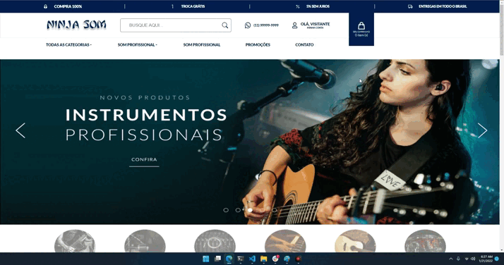

# Teste Econverse: Vaga Desenvolvedor Front-End

### Vou ser #Econverse!

Segue abaixo as informações do teste.

## Instruções
- Click neste [Link](https://ronald-assis.github.io/teste-front-end) para poder ver a pagina operando.

## Especificações Técnicas
Essa é uma pequena ilustraçãoa de como esta o projeto:

## Ferramentas
- React.js;
- Pré-processador Sass;
- Eslint;
- Biblioteca de ícones: react-icons;

## Contato
- WhatsApp: (11) 97849-3897 || (11) 98744-7055;
- Linkedin: [Ronald Assis](https://www.linkedin.com/in/ronald-assis/);
- Gmail: ronaldassis@gmail.com;
- Instagram: [ronald_assis.s](https://www.instagram.com/ronald_assis.s/);

**Obrigado pela oportunidade! ;)**
